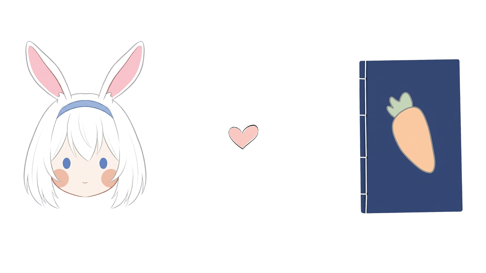

# [Usagi](#)

### Introduction

**Usagi** (*Japanese transliteration of "rabbit"*, うさぎ) **is a free and open source manga reader app for Android 5.0+ devices with many unique features, inspired by [Kotatsu](https://github.com/KotatsuApp/Kotatsu).**

### Biography

She's just an adorable, gentle, and shy female rabbit, found somewhere in Japan. When no one's looking, she always acts on instinct: Finding some books in library, reading manga and eating candy while sitting in Kotatsu (*wooden table frame covered by a futon, or heavy blanket*) in her house during the winter.

**Favorite foods: 🥕 and 🍡**. It's just a funny biography, well...**Nevermind!**

### Our works

With **[Usagi](#)**, we prioritize providing users with a convenient, fast, and smooth experience. Building on past successes, we continuously improve the user experience, offering more outstanding features while comprehensively optimizing for all devices. The community is highly creative, so we are constantly improving the project to give users more control and customization.
